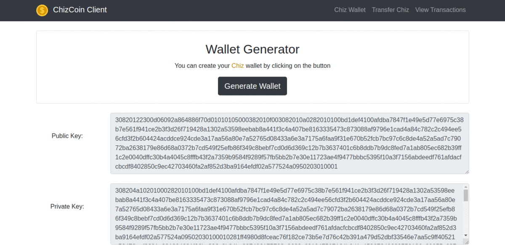

# ChizCoin : a simple blockchain implementation using python
 in a very noob way, i used flask to build API and bootstrap to makeup a (so called) frontend and ajax to handle requests
 in general it was all for training .
  #### Node Demo
 
  #### Client Demo
 
## What is ChizCoin?
 ChizCoin consists of 2 main parts :
  1. ChizCoin Node: 
		  Node's features:
		  - Several Nodes can connect together and resolve chain conflicts 		between each other
		  - (Simple) Proof of Work algorithm
		  - RSA ecryption in transactions 
		  - Beautiful main page :") tss
		  - Dashboard for miners
2. ChizCoin Client:
		Client's features:
		- Public/Private key encryption is used in wallet generation
		- again , RSA encryption in generation transaction.

## sources
- The main source is [Blockchain Python tutorial](http://adilmoujahid.com/posts/2018/03/intro-blockchain-bitcoin-python/)
- The second and very useful source is [Jadi's blockchain tutorial playlist on Youtube](https://www.youtube.com/watch?v=8bwHbnandGo&list=PL-tKrPVkKKE1gLxAL-56H-XR-fTapqofC&pbjreload=101)
- The RSA encryption and generating wallet in details can be found in [this awsome notebook](https://github.com/julienr/ipynb_playground/blob/master/bitcoin/dumbcoin/dumbcoin.ipynb)

## Requirements 
requirements can be found in requirement.txt file and can be installed using 
```
pip3 install -r requirements.txt
```

## How to run Chiz node/client?
#### node
 go to the `blockchain_node` folder and run :
```sh
python blockchain.py [-p port]
```
default port for node is `5000` but you can set different port number , for example ` python blockchain.py -p 5050` runs the node on porn number `5050`.
you can access Chiz Node by going to `localhost:5000` (or port number instead of `5000`)
#### client
go to `blockchain_client` folder and run
```sh
python blockchain_client [-p port]
```
default port for client is `8080` but you can set different port number.
you can access Chiz Client by going to `localhost:8080` (or port number instead of `8080`)


Here's a thing 
### This won't be bugless
